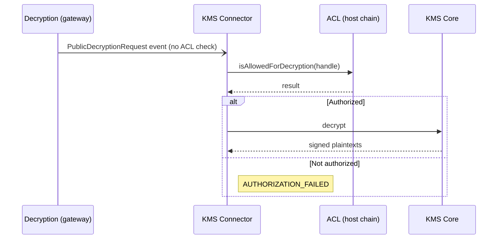
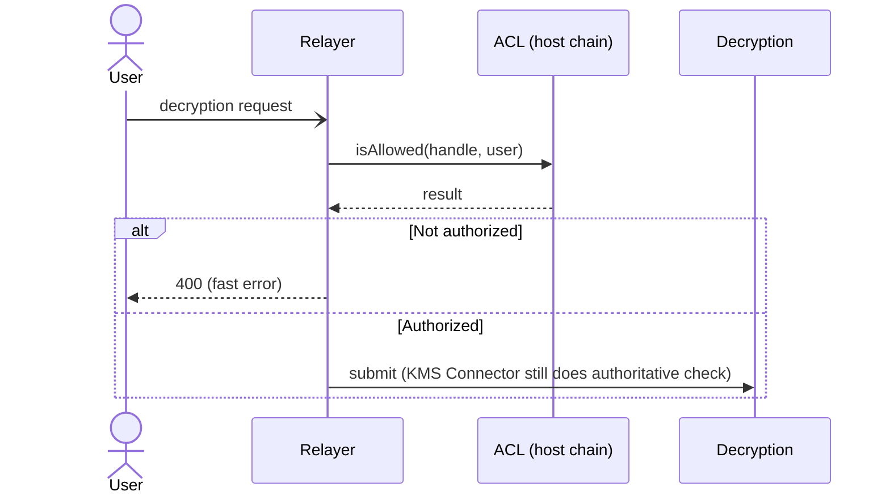

# FHEVM: Access Control List (ACL)

`ACL` (host chain) governs who can use, share, and decrypt encrypted handles. **Every handle is born with an empty access list** — nothing works until access is explicitly granted. No FHE operation proceeds without the caller having ACL access to all input handles.

## Storage

```solidity
struct ACLStorage {
    mapping(bytes32 handle => mapping(address => bool)) persistedAllowedPairs;
    mapping(bytes32 handle => bool) allowedForDecryption;
    mapping(address delegator =>
        mapping(address delegate =>
            mapping(address contractAddress => UserDecryptionDelegation))) userDecryptionDelegations;
    mapping(address => bool) denyList;
}

struct UserDecryptionDelegation {
    uint64 expirationDate;            // unix timestamp
    uint64 lastBlockDelegateOrRevoke; // prevents same-block changes
    uint64 delegationCounter;         // monotonic, tracks delegate/revoke ordering
}
```

Transient allowances live in EVM transient storage (EIP-1153, `TSTORE`/`TLOAD`) and are cleared at the end of the tx — they're not in `ACLStorage`.

## Access types

### 1. Persistent — `allow(handle, account)`

Permanent on-chain grant.

```solidity
function allow(bytes32 handle, address account) external;
function persistAllowed(bytes32 handle, address account) external view returns (bool);
```

Caller requirements: not on the deny list, and already has persistent access to `handle`. Emits `Allowed(handle, account)`.

### 2. Transient — `allowTransient(handle, account)`

Per-tx grant via `TSTORE`. Cleared automatically when the tx ends.

```solidity
function allowTransient(bytes32 handle, address account) external;
function isAllowedTransient(bytes32 handle, address account) external view returns (bool);
```

Caller must already have persistent access to `handle`. Use for cross-contract callbacks that don't warrant persistent state.

### 3. Public decryption — `allowForDecryption(handles[])`

Marks handles as eligible for `Decryption.publicDecryptionRequest`.

```solidity
function allowForDecryption(bytes32[] calldata handles) external;
function isAllowedForDecryption(bytes32 handle) external view returns (bool);
```

Emits `AllowedForDecryption(handle)`.

### 4. Combined check — `isAllowed`

Called by `FHEVMExecutor` before every op. Returns true if the account has either persistent OR transient access.

```solidity
function isAllowed(bytes32 handle, address account) external view returns (bool);
```

## Deny list

```solidity
function addAccountToDenyList(address account) external;     // onlyOwner
function removeAccountFromDenyList(address account) external; // onlyOwner
```

A denied account cannot call any `allow*`, and `isAllowed` reverts in `FHEVMExecutor` paths.

## User-decryption delegation

Lets a delegate decrypt on behalf of the delegator, scoped to a contract.

```solidity
function delegateForUserDecryption(
    address delegate,
    address contractAddress,
    uint256 expirationDate
) external;

function revokeDelegationForUserDecryption(
    address delegate,
    address contractAddress
) external;

function isDelegatedForUserDecryption(
    address delegator,
    address delegate,
    address contractAddress
) external view returns (bool);
```

`delegate` and `revoke` both reject if `lastBlockDelegateOrRevoke == block.number` — delegation state cannot change twice in the same block. This blocks flash-loan / same-block manipulation. `expirationDate` must be in the future.

## Auto-grants by `FHEVMExecutor`

When the executor returns an output handle, it auto-grants persistent access to `msg.sender` (the calling contract) — and to `tx.origin` where applicable. **This grant is for the current tx output only.** For state that persists, the contract must still call `FHE.allowThis(handle)` so it can read the value on the next tx.

## Where ACL is enforced

The **host-chain ACL is the single source of truth**. There is no separate ACL state on the gateway — the legacy `MultichainAcl` propagation system was removed once the KMS Connector started reading the host ACL directly.

| Layer | Role | Authoritative? |
|-------|------|----------------|
| Relayer | Pre-check before queuing the request. Fast-fail with `400` for unauthorised callers. | No — UX only |
| Gateway `Decryption` | Emits the request event without an ACL check | No |
| KMS Connector | Calls back into the host-chain ACL before forwarding to KMS Core | **Yes** |

### Methods called by the KMS Connector

| Decryption type | Calls |
|-----------------|-------|
| Public          | `isAllowedForDecryption(handle)` |
| User            | `isAllowed(handle, user)` AND `isAllowed(handle, contract)` |
| Delegated user  | The user-decryption pair AND `isHandleDelegatedForUserDecryption(delegator, delegate, contract, handle)` |

If any check fails, the KMS Connector rejects with `AUTHORIZATION_FAILED` and KMS Core is never invoked.

### Public decryption flow



User and delegated decryption follow the same shape with additional `isAllowed` / delegation checks.

### Relayer pre-check (non-authoritative)



### Infrastructure consequence

Both the Relayer and every KMS Connector need a reliable host-chain RPC endpoint per supported chain. If the host RPC is down, decryption halts. Operators mitigate with redundant providers and fallback configuration.
